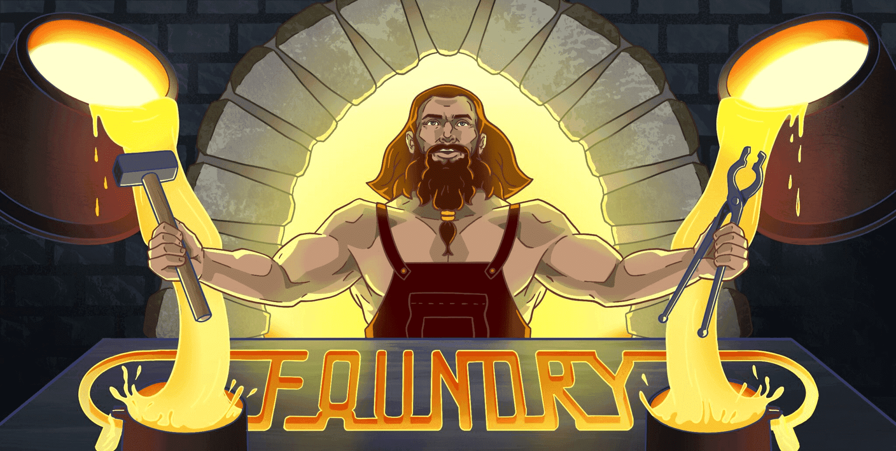

<h1>Hi 👋 My name is Ouail</h1>

Smart contracts Developer & Web3 Security Researcher

👨🏻‍💻 **About Me:**

I am a **Smart Contracts Developer** and **Web3 Security Researcher** based 🌍 in Sweden, with over two years of experience as a **front-end developer**, two years as a **blockchain developer**, and one year as a **Web3 security researcher**.I specialize in **EVM-based technologies, smart contract development, unit testing, and security reviews**. I've worked on various blockchain projects, from **DeFi to NFTs**, and reviewed multiple DeFi protocols through private audits and public contests on **Code4rena, Sherlock, and CodeHawk**.

Feel free to connect with me on [LinkedIn](https://www.linkedin.com/in/tayarthouail/) or reach out via [Gmail](mailto:ouailtbytes@gmail.com)!

## 💼 Experiences

- **Front End Developer - Freelance**
- **Full Stack Blockchain Developer - Freelance, [Rose Law Group](https://www.roselawgroup.com/)**
- **Web3 Security Researcher - [Code4rena](https://code4rena.com/), [Sherlock](https://audits.sherlock.xyz/), [Codehawks](https://www.codehawks.com/), [Rose Law Group](https://www.roselawgroup.com/)**

## 🛠️ Technologies and Tools I use:

# Most Used Languages:

